# HANG MAN 
    Họ và tên : Nguyễn Xuân Thịnh – K68J - UET
    Mã sinh viên : 23020709 
    Bài tập lớn : Hangman (Lập trình nâng cao)
_________________
## GIỚI THIỆU GAME
Hangman là một trò chơi từ vựng hấp dẫn, nơi bạn sẽ thử thách khả năng đoán chữ để cứu lấy "người treo cổ". Trong mỗi ván chơi, bạn sẽ được cho biết số chữ cái của từ cần đoán và mỗi lần đoán sai một chữ cái, một phần của hình ảnh người treo cổ sẽ được vẽ lên. Mục tiêu của bạn là đoán đúng từ trước khi hình ảnh người treo cổ được hoàn thiện. Trò chơi này không chỉ giúp luyện tập vốn từ vựng và khả năng suy luận mà còn mang lại những phút giây giải trí vô cùng thú vị.

_______
[Bắt đầu game](#bắt-đầu-game)
[Chọn độ khó](#Chọn-độ-khó)
[Chọn danh mục từ](#Chọn-danh-mục-từ)
[Cách chơi](#Cách-chơi)
[Kết thúc](#Kết-thúc)

__________________
### 1 . Bắt đầu Game

Mở file exe để chơi game
Màn hình sẽ hiện ra
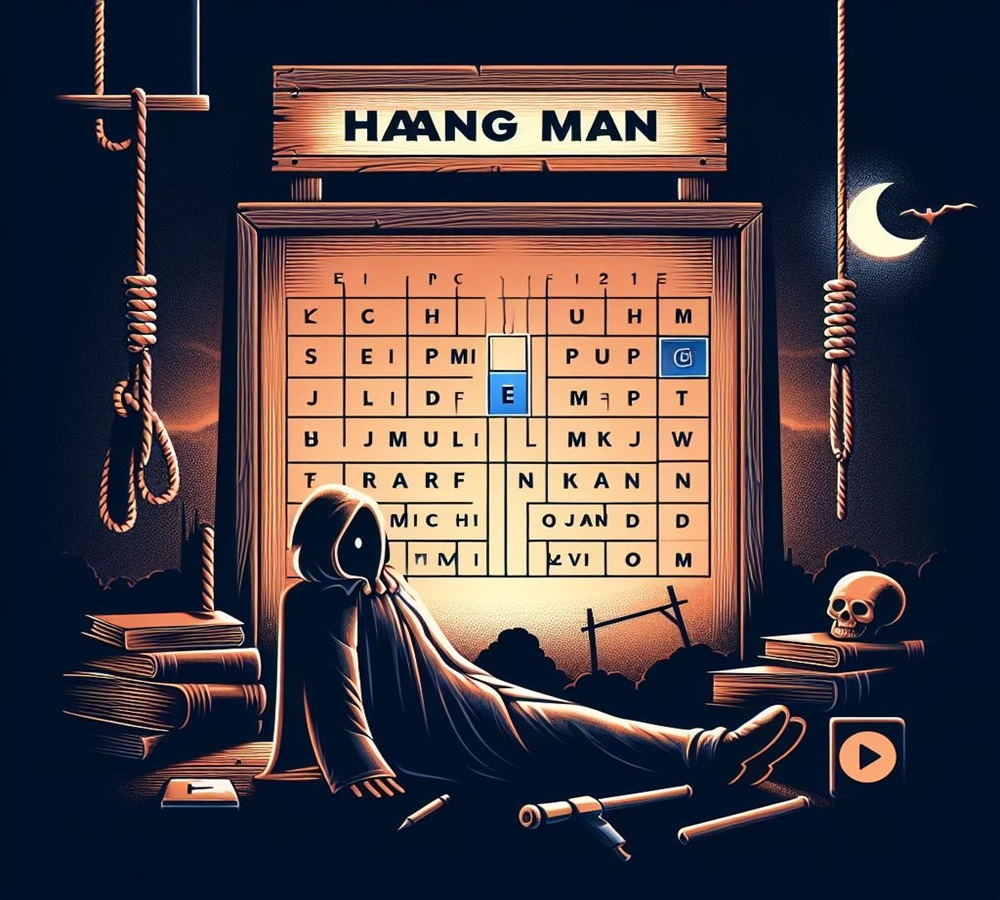

Click chuột vào ô  để có thể bắt đầu vào chơi game hoặc ấn phím **ESC** trên bàn phím để thoát

___________________
### 2 . Chọn độ khó

Có hai mức độ khó và dễ cho người lựa chọn
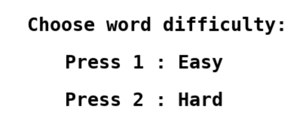
Dùng bàn phím ấn số **1** để chọn ** Dễ** và ấn số **2** để chọn **Khó**
Người chơi có thể ấn phím **ESC** để thoát 

__________________

### 3 . Chọn danh mục từ 
#### *Chế độ dễ*

>Nếu người chơi chọn chế độ Dễ thì màn hình sẽ tiếp tục hiện ra 
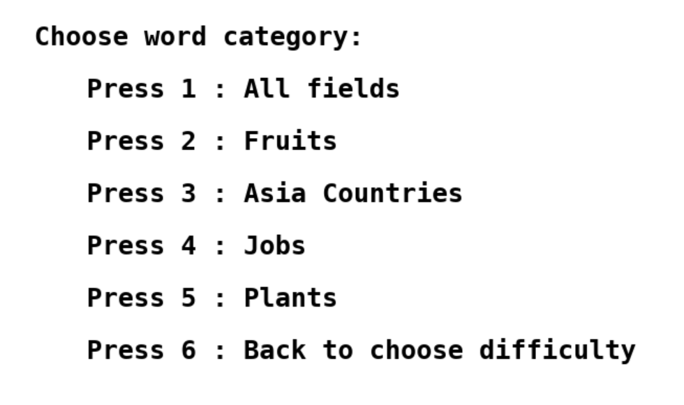 

>Có nhiều lĩnh vực khác nhau để chọn, người chơi dùng bàn phím ấn số từ **1 đến 5** để chọn danh mục từ vựng muốn chơi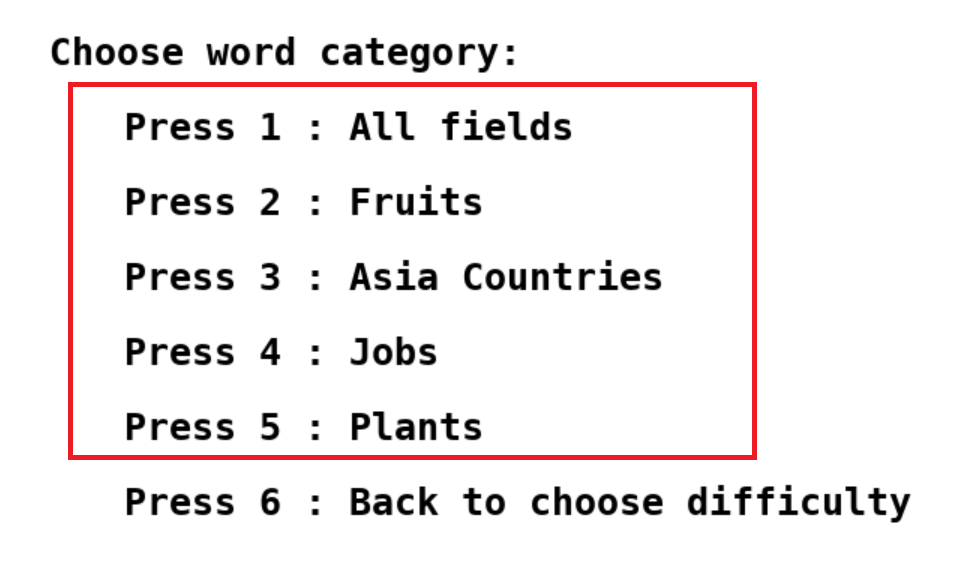 

>Nếu người chơi muốn quay lại để chọn lại độ khó thì có thể ấn phím số **6**  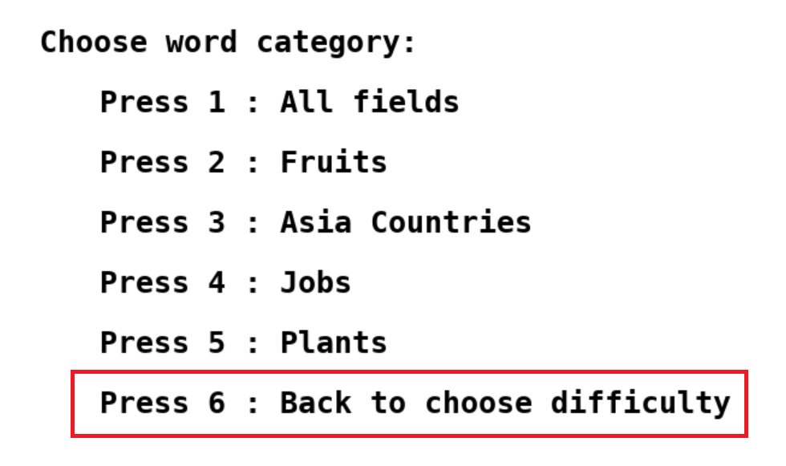

Còn ngoài ra nếu muốn thoát khỏi màn hình chơi có thể ấn phím **ESC**

#### *Chế độ khó*

>Nếu người chơi chọn chế độ Khó thì màn hình sẽ tiếp tục hiện ra 
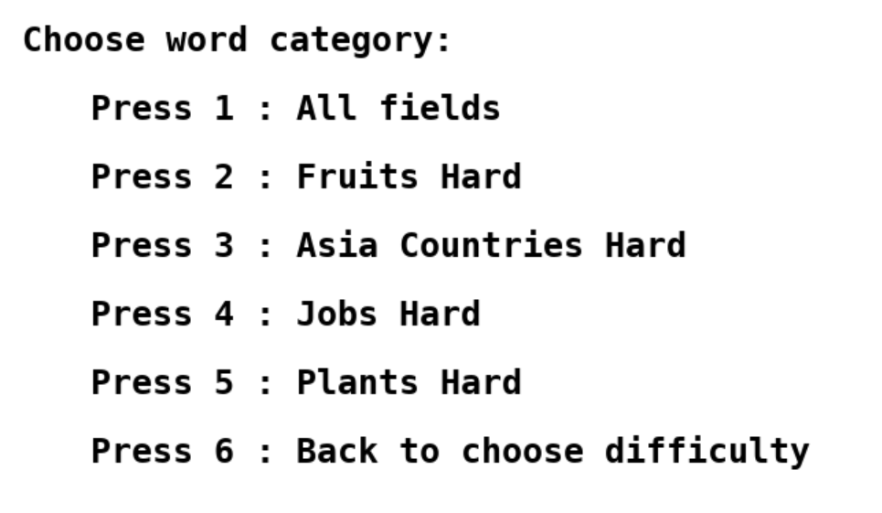 

>Cũng có nhiều lĩnh vực khác nhau để chọn, người chơi dùng bàn phím ấn số từ **1 đến 5** 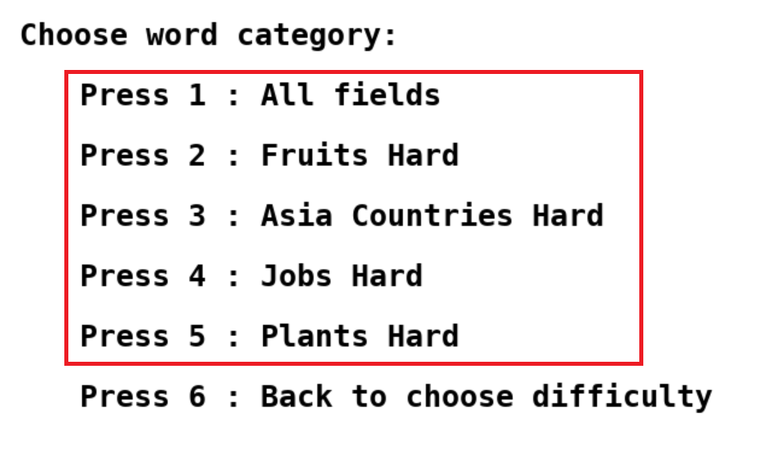 để chọn danh mục từ vựng muốn chơi

>Tương tự chế độ dễ nếu người chơi muốn quay lại để chọn lại độ khó thì có thể ấn phím số **6**  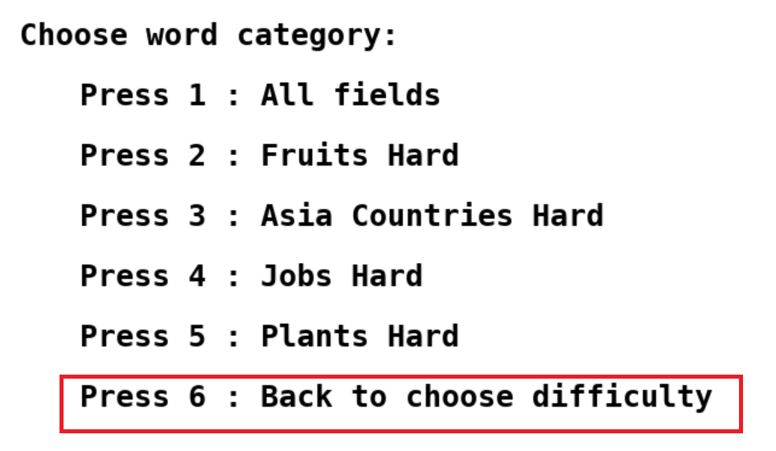

Nếu muốn thoát khỏi màn hình chơi có thể ấn phím **ESC**

### 4 . Cách chơi
Sau khi chọn độ khó và lĩnh vực muốn chơi , người chơi sẽ bắt đầu tiến hành chơi game
Người chơi sẽ phải tiến hành đoán các kí tự của từ được lấy ngẫu nhiên từ lĩnh vực đã chọn 
Mỗi lần đoán sai , màn hình sẽ dần chạy ra các phần của người bị treo cổ , sau khi đã đoán sai đủ số lần mà màn hình hoàn thành in ra toàn bộ người bị treo cổ thì người chơi sẽ bị thua
Nếu người chơi có thể đoán đúng hết các kí tự trước khi màn hình đưa ra đầy đủ người bị treo cổ thì người chơi sẽ thắng
Trong quá trình chơi nếu như người chơi cảm thấy khó quá có thể dung gợi ý 
#### *Thành phần*
>Người bị treo cổ  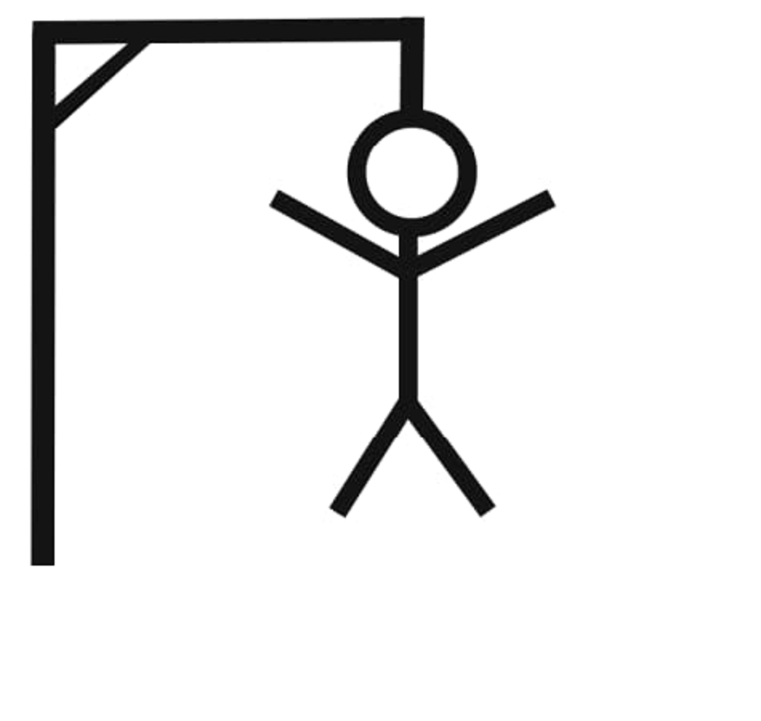

>Máy bay đưa ra từ gợi ý 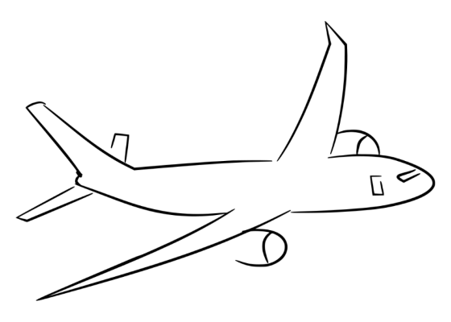

__________

### 5 . Kết thúc
>Người chơi dành chiến thắng khi đoán đúng từ bí mật
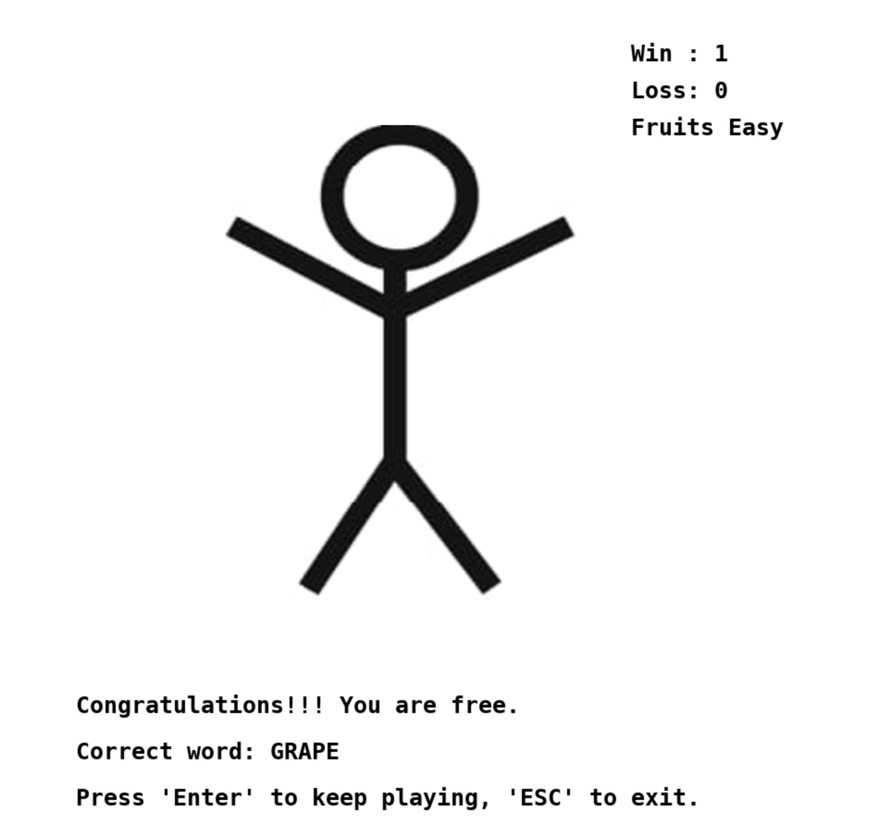

>Người chơi thua cuộc khi không thể đoán ra từ bí mật
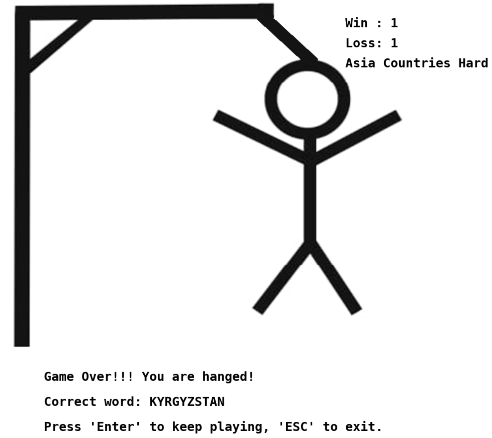

>Sau khi hoàn thành trò chơi người chơi có thể ấn phím **SPACE** để tiếp tục chơi ,mặt khác ấn phím **ESC** để thoát trò chơi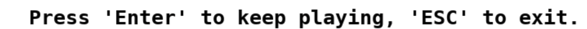

______________

**Đồ hoạ và âm thanh**
Các ảnh đều lấy từ hình ảnh trên [google](google.com) và công cụ hỗ trợ như [Bing AI](bing.com) và một số công cụ khác ….
Âm thanh được tải về từ [youtube](youtube.com) và được chuyển đổi thành các file âm thanh có đuôi phù hợp từ các trang web như : 
-	https://audio.online-convert.com/vi/convert/mp3-sang-wav
-	https://onlineconvertfree.com/vn/convert-format/mp3-to-wav

**Source code game**
- File header draw.h và window.h
   * Dùng để khởi tạo window và renderer
   * chứa tất cả các ảnh trong game (được đánh số)
   * chứa hầu hết các câu lệnh của SDL2, SDL2_image, SDL2_ttf, sử dụng để vẽ load ảnh, chữ và vẽ lên renderer, window
   * Có chứa cả phần menu
- File header diff.h và   gamelogic.h
   * Normalize : dung để chuẩn hoá các ký tự trong từ bí mật
   * chooseWord: dung để chọn ngẫu nhiên từ bí bật từ các file nguồn
   * contain : dung để kiểm tra ký tự đoán có trong từ bí mật không
   * các hàm guessing, handleGuess, badGuessed, guessEvent, updateGuessedWord: Dùng để xử lý quá trình đoán ký tự
   * các hàm getSuggest, updateSuggest : dung để xử lý  sự kiện gợi ý
   * các hàm choosefile và chooseDiff : dung để xử lý chọn độ khó, độ dễ và các danh mục lĩnh vực người chơi muốn
   * updateTimeLeft: dung  để cập nhật thời gian còn lại để người chơi biết
  * các hàm plane : dung để xử lý hình ảnh lúc đưa ra gợi ý và hình ảnh lúc đoán các kí tự trong từ bí mật 
- File chính của chương trình : hangman.cpp 
   * Chứa thành phần chính khiến chương trình có thể chạy được

